# Web Scraping for Noobs

### Table of Contents
| [Introduction](#introduction) | [Setting Up](#setting-up) | [Coding Time](#coding-time) | [The Results](#the-results) | [Optional Feature](#optional-feature) | [Resources](#resources) |
|-------------------------------|---------------------------|-----------------------------|-----------------------------|-----------------------------------------|-------------------------|

_haha, get it, it's an actual table 🤭_
<br><br>

# Introduction
Hey there party people 👋! 

How is everyone? That's a rhetorical question, I can't hear you... Anywho, I have put together a fun little **template repository** to help introduce the topic of **`Web Scraping in Python🐍`**! We will go through the different requirements and installations to get started, how to go about laying out your code, actually coding, common mistakes, etc, etc.

_Ready... Set..._ **GO!**

<br>

# Setting Up
Before we can get to the fun stuff there are a couple of things you need to have installed. Please take the time to _carefully_ go through the installation processes❤️:

## Installations
### 1. Python & Pip
- [Python Installation Guide](https://realpython.com/installing-python/)
- [Pip Installation Guide](https://pip.pypa.io/en/stable/installation/)

### 2. Selenium
This is the python package that allows us to interact with the [WebDriver](#4-chromedriver) to run our code.
```python
pip install selenium      # or pip3 install selenium
```

### 3. ChromeDriver
We will be scraping using something called a **ChromeDriver**--a type of WebDriver specifically for Chrome. A WebDriver _is an open source tool for automated testing of webapps across many browsers_[^1].

1. To download a ChromeDriver first check what `version` of Google Chrome you are currently running.
2. Then navigate [here](https://chromedriver.chromium.org/downloads) and click the download that matches the version number you just found.
3. Finally, `extract` the chromedriver.exe file and save it in the **same** folder as your code

<div align="center">
  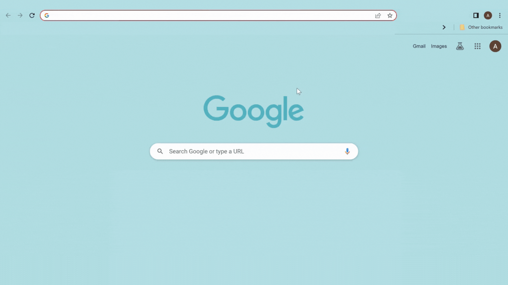
</div>

### 4. SQLite3 [_(for optional feature)_](#optional-feature)
If you're interested in storing the results of your scraping in a quick and simple database or csv file!
```python
pip install pysqlite3      # or pip3 install pysqlite3
```

<br>


# Coding Time
Alrighty, assuming that is all done, it's time to get coding! To start, go ahead and open the `scraper.py` file that came with this repository.

<details>
  <summary>A breakdown of what each of the imports does</summary>
  
  ```python
  from selenium import webdriver                           # so we can instantiate a WebDriver
  from selenium.webdriver.common.keys import Keys          # let's us 'type' things in the browser (i.e. in the searchbar)
  from selenium.webdriver.chrome.options import Options    # so we can configure our WebDriver settings (e.g. how verbose it should be)
  from selenium.webdriver.common.by import By              # to let selenium find elements *by* different identifiers (e.g. by class)
  import time                                              # because sometimes we have to tell our program to wait a bit!
  ```
</details>

With that all sorted let's set up our webdriver.
<br><br>

## 1. Configuring the WebDriver
Most of the time the following code won't change from project-to-project so don't feel bad just copy-pasting it whenever you need it!
```python
# SETTING UP BROWSER
#-----------------------
chrome_options = Options()
# chrome_options.add_argument("--headless")
chrome_options.add_experimental_option("detach", True)
chrome_options.add_argument("--log-level=3")
prefs = {"profile.default_content_setting_values.notifications" : 2}
chrome_options.add_experimental_option("prefs",prefs)
browser = webdriver.Chrome(options=chrome_options)
browser.set_window_size(1080, 960)
```


**The Breakdown**
<br>
- `chrome_options = Options()` allows you to configure your WebDriver to suit your needs. There are a gazillion-and-one different [option arguments](https://peter.sh/experiments/chromium-command-line-switches/) you can add and experiment with.

- `chrome_options.add_argument("--headless")` makes sure that when you run the code, the actual chrome browser doesn't pop up. Comment this out for now 🤓

- `chrome_options.add_experimental_option("detach", True)` helps make sure the browser we control doesn't close every time our program finishes running! This helps us to see how far our program got/where an error is occuring/our victory!

- ```chrome_options.add_experimental_option("prefs",prefs)``` handle any chrome notifications (e.g. Allow/Block permission notification boxes) that confuse our scraper😖

- `chrome_options.add_argument("--log-level=3")` to only show you important warnings (thank me later)
     - INFO = 0, WARNING = 1, LOG_ERROR = 2, LOG_FATAL = 3.
 
- `browser = webdriver.Chrome(options=chrome_options)` instantiates a ChromeDriver with the options we chose
- `browser.set_window_size(1080, 960)` is just for funsies and, I think, pretty self-explanatory

<br>

> **N.B.** You do not have to call your WebDriver 'browser', this is just my personal preference. Often, when you read things online, it will either be called either **browser** or **driver**

<br>

## 2. Navigating to URLs
For the sake of this 'tutorial', we will be navigating to, and scraping from, **Reddit** as it is and, should continue to be, legal to scrape from. Please always make sure you double check the rules different sites have on web-scraping **_before_** you start a project! 
```python
# TO REDDIT WE GO
#-----------------------
reddit_url = "https://www.reddit.com"
browser.get(reddit_url)
```

<br>

## 3. Interacting with the UI
But, quite frankly, it's not enough to just _go_ to a website, we also want to be able to _interact_ with it, right? Trick question: Right! Interacting with a website could mean:
- Clicking on a button
- Typing in a searchbar or comment section
- Pressing enter
- Scrolling 
- etc

To keep things simple we'll just be focusing on the first three... but before we can do that we need to know how to **find** the elements we want to interact with. How do we find a button to click? Or a searchbar to type in? Check below!

<br>

### Finding Elements
There are several different ways to [locate elements on a webpage using selenium](https://selenium-python.readthedocs.io/locating-elements.html). Here are the 4 methods I use most frequently:

| Method                                            | Element View Example               | Inspect Element View Example               |
|---------------------------------------------------|------------------------------------|--------------------------------------------|
| browser.find_element(By.ID, "id")                 | 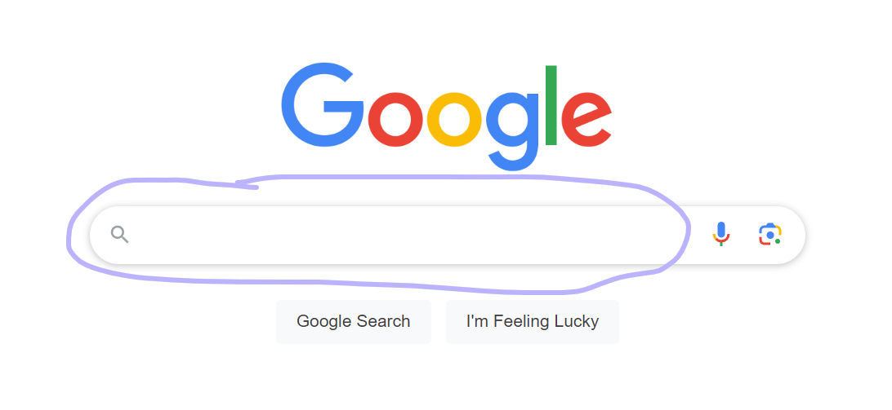         | 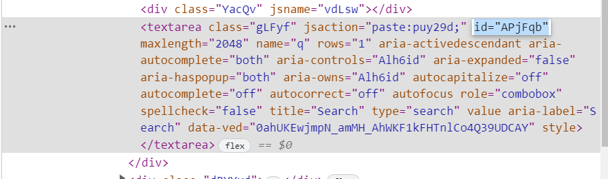         |
| browser.find_element(By.CLASS_NAME, "class name") | 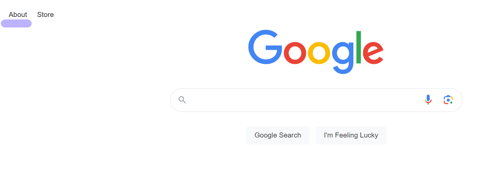 | 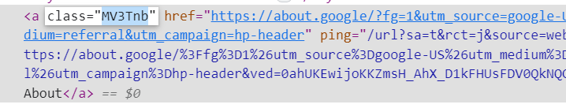 |
| browser.find_element(By.NAME, "name")             | 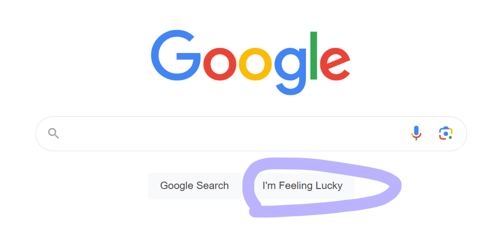       | 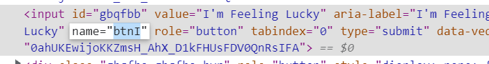       |
| browser.find_element(By.XPATH, """"xpath"""")     | 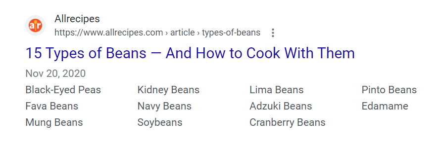      | 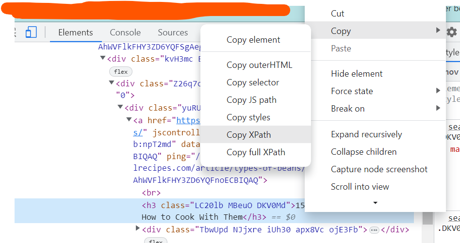      |

<br>

So, going back to our Reddit example: We have navigated to the Reddit website, but now we want to **find** the searchbar so we can look for a specific subreddit.
```python
# N.B. you tend to find that most searchbars' name is just 'q'
searchbar = browser.find_element(By.NAME, "q")
```

<br>

### Using Elements
Again, however, there is more to be done! Finding an element is _not_ the same as using that element. We can **find** a button but not necessarily **use** that button. Worry not though, using elements tends to be super easy! For our purposes, we will focus on:

- If we want to click on something (e.g. a button):
```python
button = browser.find_element(By.ID, "some button id")
button.click()
```

- If we want to type into something (e.g. a searchbar):
```python
searchbar = browser.find_element(By.NAME, "q")
searchbar.send_keys("this is something i want to type in the searchbar")
# searchbar.click()              # sometimes you need this👀
searchbar.send_keys(Keys.RETURN) # presses 'Enter' (the same as clicking the search button)
```

<br>

## 4. Putting it all together


**Trust me** with the above skills we just covered you are 90% of the way to launching your own scraper! Let's just put the final few pieces together. Here's the plan:
1. Search for "Beans" in the searchbar on Reddit's homepage
2. Click the `r/Beans` subreddit link
3. Get a list of all the post titles in the subreddit[^2]
4. Print it out to our terminal or [*insert optional feature here*](#optional-feature)

Give those steps a try by yourself if you think you can, Step 3 is a little harder so don't feel shy taking a peek at my sample code below:


<details>
  <summary>Steps One & Two</summary>
  <br>
  
  
  ```python
  def find_subreddit(subreddit):
    """Game Plan:
    - Navigates to Reddit
    - Searches for the subreddit
    - Clicks on link to subreddit

    Args:
        subreddit (str): the subreddit to be visited
    """ 
    # Navigate to reddit
    reddit_url = "https://www.reddit.com"
    browser.get(reddit_url)


    # Search for subreddit using searchbar
    searchbar = browser.find_element(By.NAME, "q")
    searchbar.send_keys("Beans")
    searchbar.click()
    searchbar.send_keys(Keys.RETURN)

    # Click subreddit link
    time.sleep(1)
    subreddit_link = browser.find_element(By.CLASS_NAME, "_1Nla8vW02K39sy0E826Iug")
    subreddit_link.click()
  ```
  
  
</details>

<br>

<details>
  <summary>Step Three</summary>
  <br>
  
  
  ```python
  def get_titles():
    """Game Plan:
    - Choose how you want to find the title elements
      - e.g by class name, tag name, xpath, etc
    - Use browser.find_elements(.........)
    - Convert each element in the list into text

    Returns:
        titles (list): a list of titles of posts found in the subreddit
    """     
    titles = []

    # Get titles in raw format
    raw_titles = browser.find_elements(By.CLASS_NAME, "_eYtD2XCVieq6emjKBH3m")

    # Convert titles (which are of type 'WebElement') into their text
    for title in raw_titles:
        titles.append(title.text)

    return titles
  ```
  
  
</details>

<br>

<details>
  <summary>Step Four</summary>
  <br>
  
  
  ```python
    def display(titles_to_display):
      """Game Plan:
      - Display your results in a cute format <3

      Args:
          titles_to_display (list): the titles to be displayed cutely
      """    
      titles_to_display = set(titles_to_display) # getting rid of duplicates!!

      random_ascii_art_from_the_internet = """
      ⠀⣰⡶⣶⣶⡶⠤⠶⢿⣿⣿⣷⣄⠀⠀⠀⠀⠀⠀⠀⠀⠀⠀⠀⠀⠀⠀⠀⠀⠀⠀⠀⠀⠀⠀⠀⠀⠀⠀⠀⠀⠀⠀⠀⠀⠀⠀⠀⠀⠀⠀⠀⠀⠀⠀⠀⠀⠀⠀⠀⠀⠀⠀⠀
  ⠀⣿⣿⣿⢻⣧⣀⠀⠀⣿⣿⣿⣏⠷⣦⣀⡀⠀⠀⠀⣀⣀⣀⣄⣀⣀⣀⡀⠀⠀⠀⠀⠀⠀⠀⠀⠀⠀⠀⠀⠀⠀⠀⠀⠀⠀⠀⠀⠀⠀⠀⠀⠀⠀⠀⠀⠀⠀⠀⠀⠀⠀⠀⠀
  ⠀⢿⣿⠙⠻⣿⣿⢶⣄⠙⠻⠟⠋⠀⠀⠈⣙⣿⠛⠛⢻⣹⣥⣿⣫⠼⠋⠙⠛⣦⣄⠀⠀⠀⠀⠀⠀⠀⠀⠀⠀⠀⠀⠀⠀⠀⠀⠀⠀⠀⠀⠀⠀⠀⠀⠀⠀⠀⠀⠀⠀⠀⠀⠀
  ⠀⠀⠉⠀⠀⠹⠏⠛⢿⣿⢦⣄⡀⠤⢤⣤⡀⠙⢠⡀⠈⠻⣦⣼⠇⠀⠀⠀⢸⡇⣿⠻⣦⠀⠀⠀⠀⠀⠀⠀⠀⠀⠀⠀⠀⠀⠀⠀⠀⠀⠀⠀⠀⠀⠀⠀⠀⠀⠀⠀⠀⠀⠀⠀
  ⠀⠀⠀⠀⠀⠀⠀⠀⠀⠙⣇⠈⠉⢛⡟⠙⠃⠀⠘⣧⣀⣀⣈⣉⣀⠀⠀⠀⢠⡇⢸⣇⣈⢷⡀⠀⠀⠀⠀⠀⠀⠀⠀⠀⠀⠀⠀⠀⠀⠀⠀⠀⠀⠀⠀⠀⠀⠀⠀⠀⠀⠀⠀⠀
  ⠀⠀⠀⠀⠀⠀⠀⠀⠀⠀⣿⠀⣠⣾⠃⠀⠀⠀⢰⡏⠁⠀⠀⠈⠙⢷⡄⠀⠈⠳⠞⠓⢮⡉⣧⠀⠀⠀⠀⠀⠀⠀⠀⠀⠀⠀⠀⠀⠀⠀⠀⠀⠀⠀⠀⠀⠀⠀⠀⠀⠀⠀⠀⠀
  ⠀⠀⢀⣤⣴⣾⡿⠿⢿⣿⢿⣿⠟⠁⣀⣀⣠⡴⠋⠀⠀⠀⠀⠀⠀⠀⣷⠀⠀⠀⠀⠀⠀⠙⢻⡇⠀⠀⠀⠀⠀⠀⠀⠀⠀⠀⠀⠀⠀⠀⠀⠀⠀⠀⠀⠀⠀⠀⠀⠀⠀⠀⠀⠀
  ⠀⣰⣏⡿⠋⠁⢀⣠⢞⣡⠞⢁⣠⠞⠋⠁⠀⠀⠀⠀⠀⠀⠀⠀⠀⢰⡟⠀⠀⠀⠀⠀⣀⠀⢸⡇⠀⠀⠀⠀⠀⠀⠀⠀⠀⠀⠀⠀⠀⠀⠀⠀⠀⠀⠀⠀⠀⠀⠀⠀⠀⠀⠀⠀
  ⠠⢿⣿⠁⠀⢰⡿⠛⠋⢁⣴⠟⠁⠀⠀⠀⠀⠀⠀⠀⠀⠀⠀⠀⣰⡟⠀⣀⣀⡀⠀⣾⠉⠉⢻⡇⠀⠀⠀⠀⠀⠀⠀⠀⠀⠀⠀⠀⠀⠀⠀⠀⠀⠀⠀⠀⠀⠀⠀⠀⠀⠀⠀⠀
  ⠀⠀⠀⠀⠀⠘⠿⠞⠛⠋⠀⠀⠀⠀⠀⠀⠀⠀⠀⠀⠀⠀⣠⡾⠋⠀⠀⣯⠀⠉⣻⣯⡶⢲⡞⠀⠀⠀⠀⠀⠀⠀⠀⠀⠀⠀⠀⠀⠀⠀⠀⠀⠀⠀⠀⠀⠀⠀⠀⠀⠀⠀⠀⠀
  ⠀⠀⠀⠀⠀⠀⠀⠀⠀⠀⠀⠀⠀⠀⠀⠀⠀⠀⠀⢀⣰⠞⠋⠀⠀⠀⠀⣸⠆⠠⣇⠀⠀⣾⠃⠀⠀⠀⠀⠀⠀⠀⠀⠀⠀⠀⠀⠀⠀⠀⠀⠀⠀⠀⠀⠀⠀⠀⠀⠀⠀⠀⠀⠀
  ⠀⠀⠀⠀⠀⠀⠀⠀⠀⠀⠀⠀⠀⠀⠀⠀⠀⣠⠾⠋⠀⠀⠀⠀⠀⠀⠀⠈⠓⠢⣬⢻⣾⠃⠀⠀⠀⠀⠀⠀⠀⠀⠀⠀⠀⠀⠀⠀⠀⠀⠀⠀⠀⠀⠀⠀⠀⠀⠀⠀⠀⠀⠀⠀
  ⠀⠀⠀⠀⠀⠀⠀⠀⠀⠀⠀⠀⠀⠀⣠⡴⠛⠁⠀⢀⣀⣀⢀⣀⠀⠀⠀⠀⠀⠀⣸⡿⠁⠀⠀⠀⠀⠀⠀⠀⠀⠀⠀⠀⠀⠀⠀⠀⠀⠀⠀⠀⠀⠀⠀⠀⠀⠀⠀⠀⠀⠀⠀⠀
  ⠀⠀⠀⠀⠀⠀⠀⠀⠀⠀⠀⢀⣴⠞⠉⠀⠀⠀⠀⠘⣇⠈⠉⠉⢳⡄⠀⠀⢀⡼⠋⠀⠀⠀⠀⠀⠀⠀⠀⠀⠀⠀⠀⠀⠀⠀⠀⠀⠀⠀⠀⠀⠀⠀⠀⠀⠀⠀⠀⠀⠀⠀⠀⠀
  ⠀⠀⠀⠀⠀⠀⠀⠀⠀⢀⡴⠟⠁⠀⠀⠀⠀⠀⠀⣠⠾⢀⡾⢳⡀⢳⣄⡴⠛⠁⠀⠀⠀⠀⠀⠀⠀⠀⠀⠀⠀⠀⠀⠀⠀⠀⠀⠀⠀⠀⠀⠀⠀⠀⠀⠀⠀⠀⠀⠀⠀⠀⠀⠀
  ⠀⠀⠀⠀⠀⠀⠀⠀⣴⠟⠁⠀⠀⠀⠀⠀⠀⠀⠰⡏⠀⢿⡀⠈⣧⡾⠋⠀⠀⠀⠀⠀⠀⠀⠀⠀⠀⠀⠀⠀⠀⠀⠀⠀⠀⠀⠀⠀⠀⠀⠀⠀⠀⠀⠀⠀⠀⠀⠀⠀⠀⠀⠀⠀
  ⠀⠀⠀⠀⠀⠀⠀⣾⠋⠀⠀⠀⠀⠀⠀⠀⠀⠀⠀⠹⢦⣀⣿⠞⠁⠀⠀⠀⠀⠀⠀⠀⠀⠀⠀⠀⢀⣀⣠⣶⠶⢶⣶⡶⠦⣄⣀⡀⠀⠀⠀⠀⠀⠀⠀⠀⠀⠀⠀⠀⠀⠀⠀⠀
  ⠀⠀⠀⠀⠀⠀⣼⠁⠀⠀⠀⠀⠀⠀⠀⠀⠀⠀⠀⢀⣴⠟⠁⠀⠀⠀⠀⠀⠀⠀⠀⠀⠀⢀⣤⠶⠛⠉⠀⠙⠦⣄⠈⣹⡄⠀⠉⡽⠶⣄⠀⠀⠀⠀⠀⠀⠀⠀⠀⠀⠀⠀⠀⠀
  ⠀⠀⠀⠀⠀⢠⡟⠀⠀⠀⠀⠀⠀⢀⡖⠒⢦⣤⣰⡟⠁⠀⠀⠀⠀⠀⠀⠀⠀⠀⠀⠀⣤⠟⢳⣄⠀⠀⠀⠀⠀⣿⠀⠛⠛⠢⠞⠁⢀⣘⣦⡀⠀⠀⠀⠀⠀⠀⠀⠀⠀⠀⠀⠀
  ⠀⠀⠀⠀⠀⢸⡇⠀⠀⠀⠀⠀⢀⣼⡇⢸⡖⣾⠏⠀⠀⠀⠀⠀⠀⠀⠀⠀⠀⠀⢀⣼⢯⣀⣸⠃⠀⠀⠀⠀⠀⣿⣠⠴⢦⣄⣀⡼⠋⠀⠘⣧⠀⠀⠀⠀⠀⠀⠀⠀⠀⠀⠀⠀
  ⠀⠀⠀⠀⠀⢸⠃⠀⠀⠀⠀⢠⠟⢿⣿⣩⣴⢿⠀⠀⠀⠀⠀⠀⠀⠀⠀⠀⠀⢀⣾⣁⠴⠟⠉⢳⡄⠀⠀⠀⣀⣈⠀⠀⠀⠈⠁⠀⠀⠀⠀⣿⠀⠀⠀⠀⠰⣶⣶⢤⣄⠀⠀⠀
  ⠀⠀⠀⠀⠀⢸⠀⠀⠀⠀⠀⠈⢧⣀⡭⠤⣿⢈⣇⠀⠀⠀⠀⠀⠀⠀⠀⠀⣰⣟⠉⢁⡴⠒⠒⠚⢁⣤⠞⠋⠉⠉⠛⠳⣄⠀⠀⠀⣤⠖⢒⣿⠀⠀⠀⠀⠀⠀⠈⢧⡈⢳⡄⠀
  ⠀⠀⠀⠀⠀⢹⡇⠀⠀⠀⠀⠀⠀⠀⠀⠀⣿⠉⠙⣧⣄⠀⠀⠀⠀⢀⣠⡾⠋⠈⠉⠁⠀⠀⠀⣰⠟⠀⠀⠀⠀⠀⠀⠀⠈⢷⠀⠀⣸⣦⣿⡏⠀⠀⠀⠀⠀⠀⠀⠈⣷⠀⢿⡀
  ⠀⠀⠀⠀⠀⢸⣇⠀⠀⠀⠀⠀⠀⠀⠀⠀⢹⡦⢸⡇⢹⡙⠓⣶⠚⠋⣿⠀⠀⠀⠀⠀⠀⠀⣼⠃⠀⠀⠀⠀⠀⠀⠀⠀⠀⢸⢤⠟⢁⣛⡾⠁⠀⠀⠀⠀⠀⠀⠀⠀⣼⢳⠈⣧
  ⠀⠀⠀⠀⠀⠀⢿⣄⠀⠀⠀⠀⠀⠀⠀⠀⠀⠁⠀⢣⠀⣱⠀⣸⠀⣠⠟⠀⠀⠀⠀⠀⠀⣼⠃⠀⠀⠀⠀⠀⠀⠀⠀⠀⠀⣸⠈⠉⠉⢹⡇⠀⠀⠀⠀⠀⠀⠀⠀⢠⣏⣘⣧⣿
  ⠀⠀⠀⠀⠀⠀⠈⢿⡄⠀⠀⠀⠀⠀⠀⠀⠀⠀⠀⣞⠀⣿⣋⠁⣸⠃⠀⠀⠀⠀⠀⠀⣴⠏⠀⠀⠀⠀⠀⠀⠀⠀⠀⠀⠀⢿⡄⠀⢀⠼⣧⡀⠀⠀⠀⠀⠀⠀⣠⠟⠁⠉⢀⡏
  ⠀⠀⠀⠀⠀⠀⠀⠀⠹⣦⡀⠀⠀⠀⠀⠀⠀⠀⠀⠉⠉⠉⠉⠉⠁⠀⠀⠀⠀⠀⢀⣴⠏⠀⠀⠀⠀⠀⠀⠀⠀⠀⠀⠀⠀⠘⣷⡀⠘⠒⠚⠻⣶⣤⣤⡤⠶⣿⠁⠀⠀⢀⡿⠁
  ⠀⠀⠀⠀⠀⠀⠀⠀⠀⠀⠙⢶⣄⣀⠀⠀⠀⠀⠀⠀⠀⠀⠀⠀⠀⠀⠀⠀⢀⣠⡞⠃⠀⠀⠀⠀⠀⠀⠀⠀⠀⠀⠀⠀⠀⠀⠈⠻⣄⠀⠀⠀⣧⡙⢻⡶⠚⠁⠀⢀⡴⠟⠀⠀
  ⠀⠀⠀⠀⠀⠀⠀⠀⠀⠀⠀⠀⠀⠉⠛⠲⢤⣤⣤⣀⣀⣀⣀⣀⣤⣤⠴⠛⠋⠀⠀⠀⠀⠀⠀⠀⠀⠀⠀⠀⠀⠀⠀⠀⠀⠀⠀⠀⠈⠛⠶⢤⣤⣿⣾⣥⣤⠶⠛⠋⠀⠀⠀⠀
  ⠀⠀⠀⠀⠀⠀⠀⠀⠀⠀⠀⠀⠀⠀⠀⠀⠀⠀⠀⠀⠀⠀⠀⠀⠀⠀⠀⠀⠀⠀⠀⠀⠀⠀⠀⠀⠀⠀⠀⠀⠀⠀⠀⠀⠀⠀⠀⠀⠀⠀⠀⠀⠀⠀⠀⠀⠀⠀⠀⠀⠀⠀⠀⠀
  ⠀⠀⠀⠀⠀⠀⠀⠀⠀⠀⠀⠀⠀⠀⠀⠀⠀⠀⠀⠀⠀⠀⠀⠀⠀⠀⠀⠀⠀⠀⠀⠀⠀⠀⠀⠀⠀⠀⠀⠀⠀⠀⠀⠀⠀⠀⠀⠀⠀⠀⠀⠀⠀⠀⠀⠀⠀⠀⠀⠀⠀⠀⠀⠀
  ⠀⠀⠀⠀⠀⠀⠀⠀⠀⠀⠀⠀⠀⠀⠀⠀⠀⠀⠀⠀⠀⠀⠀⠀⠀⠀⠀⠀⠀⠀⠀⠀⠀⠀⠀⠀⠀⠀⠀⠀⠀⠀⠀⠀⠀⠀⠀⠀⠀⠀⠀⠀⠀⠀⠀⠀⠀⠀⠀⠀⠀⠀⠀⠀
  ⠀⠀⠀⠀⠀⠀⠀⠀⠀⠀⠀⠀⠀⠀⠀⠀⠀⠀⠀⠀⠀⠀⠀⠀⠀⠀⠀⠀⠀⠀⠀⠀⠀⠀⠀⠀⠀⠀⠀⠀⠀⠀⠀⠀⠀⠀⠀⠀⠀⠀⠀⠀⠀⠀⠀⠀⠀⠀⠀⠀⠀⠀⠀⠀
  ⠀⠀⠀⠀⠀⠀⠀⠀⠀⠀⠘⠲⣶⠒⠲⣄⠀⠀⠀⠀⠀⠀⠀⠀⠀⠀⠀⠀⣧⡀⠀⠀⠀⠀⠀⢰⣦⠀⠀⠀⠀⠀⠀⠀⠀⠀⠀⠀⢀⠀⠀⠀⠀⣠⠞⠂⠀⠀⠀⠀⠀⠀⠀⠀
  ⠀⠀⠀⠀⠀⠀⠀⠀⠀⡀⠀⢾⣿⠀⠀⢸⢻⠚⠀⠀⠀⢘⠀⠻⠀⠀⠀⣰⣧⣷⡄⠘⡶⠉⠁⠐⡆⠻⠂⠆⠒⠀⠎⣷⠀⠀⠀⠀⠀⠀⠀⠀⠀⡎⠀⠀⠀⠀⠀⠀⠀⠀⠀⠀
  ⠀⠀⠀⠀⢀⡀⠀⠀⡀⠀⠀⣹⣿⠤⠖⢁⠼⠀⠀⠠⠤⠠⠤⠯⡄⢀⡴⣃⠀⠀⠸⠒⠃⢰⡇⠠⠅⠘⠀⡇⠠⠆⠩⠿⠄⢿⠗⠦⠚⠀⢾⠟⠈⢧⡴⠄⠀⠠⣤⠀⠀⠀⠀⠀
      """

      print(random_ascii_art_from_the_internet + "\n\n\n")

      for idx, title in enumerate(titles_to_display):
          print(f"{idx}: {title}\n")
  ```
  
  
</details>

<br>

<details>
  <summary>Full Sample Code</summary>
  <br>
  
  
  ```python
  from selenium import webdriver
  from selenium.webdriver.common.keys import Keys
  from selenium.webdriver.chrome.options import Options
  from selenium.webdriver.common.by import By
  import time


  # Configuring Browser
  #---------------------------------------------------------
  chrome_options = Options()
  chrome_options.add_argument("--headless")
  chrome_options.add_experimental_option("detach", True)
  chrome_options.add_argument("--log-level=3")
  prefs = {"profile.default_content_setting_values.notifications" : 2}
  chrome_options.add_experimental_option("prefs",prefs)
  browser = webdriver.Chrome(options=chrome_options)
  browser.set_window_size(1080, 960)


  # FILL IN THE BLANKS
  #---------------------------------------------------------

  def find_subreddit(subreddit):
      """Game Plan:
      - Navigates to Reddit
      - Searches for the subreddit
      - Clicks on link to subreddit

      Args:
          subreddit (str): the subreddit to be visited
      """ 
      # Navigate to reddit
      reddit_url = "https://www.reddit.com"
      browser.get(reddit_url)


      # Search for subreddit using searchbar
      searchbar = browser.find_element(By.NAME, "q")
      searchbar.send_keys("Beans")
      searchbar.click()
      searchbar.send_keys(Keys.RETURN)

      # Click subreddit link
      time.sleep(1)
      subreddit_link = browser.find_element(By.CLASS_NAME, "_1Nla8vW02K39sy0E826Iug")
      subreddit_link.click()


  def get_titles():
      """Game Plan:
      - Choose how you want to find the title elements
        - e.g by class name, tag name, xpath, etc
      - Use browser.find_elements(.........)
      - Convert each element in the list into text

      Returns:
          titles (list): a list of titles of posts found in the subreddit
      """     
      titles = []

      # Get titles in raw format
      raw_titles = browser.find_elements(By.CLASS_NAME, "_eYtD2XCVieq6emjKBH3m")

      # Convert titles (which are of type 'WebElement') into their text
      for title in raw_titles:
          titles.append(title.text)

      return titles


  def display(titles_to_display):
      """Game Plan:
      - Display your results in a cute format <3

      Args:
          titles_to_display (list): the titles to be displayed cutely
      """    
      titles_to_display = set(titles_to_display) # getting rid of duplicates!!

      random_ascii_art_from_the_internet = """
      ⠀⣰⡶⣶⣶⡶⠤⠶⢿⣿⣿⣷⣄⠀⠀⠀⠀⠀⠀⠀⠀⠀⠀⠀⠀⠀⠀⠀⠀⠀⠀⠀⠀⠀⠀⠀⠀⠀⠀⠀⠀⠀⠀⠀⠀⠀⠀⠀⠀⠀⠀⠀⠀⠀⠀⠀⠀⠀⠀⠀⠀⠀⠀⠀
  ⠀⣿⣿⣿⢻⣧⣀⠀⠀⣿⣿⣿⣏⠷⣦⣀⡀⠀⠀⠀⣀⣀⣀⣄⣀⣀⣀⡀⠀⠀⠀⠀⠀⠀⠀⠀⠀⠀⠀⠀⠀⠀⠀⠀⠀⠀⠀⠀⠀⠀⠀⠀⠀⠀⠀⠀⠀⠀⠀⠀⠀⠀⠀⠀
  ⠀⢿⣿⠙⠻⣿⣿⢶⣄⠙⠻⠟⠋⠀⠀⠈⣙⣿⠛⠛⢻⣹⣥⣿⣫⠼⠋⠙⠛⣦⣄⠀⠀⠀⠀⠀⠀⠀⠀⠀⠀⠀⠀⠀⠀⠀⠀⠀⠀⠀⠀⠀⠀⠀⠀⠀⠀⠀⠀⠀⠀⠀⠀⠀
  ⠀⠀⠉⠀⠀⠹⠏⠛⢿⣿⢦⣄⡀⠤⢤⣤⡀⠙⢠⡀⠈⠻⣦⣼⠇⠀⠀⠀⢸⡇⣿⠻⣦⠀⠀⠀⠀⠀⠀⠀⠀⠀⠀⠀⠀⠀⠀⠀⠀⠀⠀⠀⠀⠀⠀⠀⠀⠀⠀⠀⠀⠀⠀⠀
  ⠀⠀⠀⠀⠀⠀⠀⠀⠀⠙⣇⠈⠉⢛⡟⠙⠃⠀⠘⣧⣀⣀⣈⣉⣀⠀⠀⠀⢠⡇⢸⣇⣈⢷⡀⠀⠀⠀⠀⠀⠀⠀⠀⠀⠀⠀⠀⠀⠀⠀⠀⠀⠀⠀⠀⠀⠀⠀⠀⠀⠀⠀⠀⠀
  ⠀⠀⠀⠀⠀⠀⠀⠀⠀⠀⣿⠀⣠⣾⠃⠀⠀⠀⢰⡏⠁⠀⠀⠈⠙⢷⡄⠀⠈⠳⠞⠓⢮⡉⣧⠀⠀⠀⠀⠀⠀⠀⠀⠀⠀⠀⠀⠀⠀⠀⠀⠀⠀⠀⠀⠀⠀⠀⠀⠀⠀⠀⠀⠀
  ⠀⠀⢀⣤⣴⣾⡿⠿⢿⣿⢿⣿⠟⠁⣀⣀⣠⡴⠋⠀⠀⠀⠀⠀⠀⠀⣷⠀⠀⠀⠀⠀⠀⠙⢻⡇⠀⠀⠀⠀⠀⠀⠀⠀⠀⠀⠀⠀⠀⠀⠀⠀⠀⠀⠀⠀⠀⠀⠀⠀⠀⠀⠀⠀
  ⠀⣰⣏⡿⠋⠁⢀⣠⢞⣡⠞⢁⣠⠞⠋⠁⠀⠀⠀⠀⠀⠀⠀⠀⠀⢰⡟⠀⠀⠀⠀⠀⣀⠀⢸⡇⠀⠀⠀⠀⠀⠀⠀⠀⠀⠀⠀⠀⠀⠀⠀⠀⠀⠀⠀⠀⠀⠀⠀⠀⠀⠀⠀⠀
  ⠠⢿⣿⠁⠀⢰⡿⠛⠋⢁⣴⠟⠁⠀⠀⠀⠀⠀⠀⠀⠀⠀⠀⠀⣰⡟⠀⣀⣀⡀⠀⣾⠉⠉⢻⡇⠀⠀⠀⠀⠀⠀⠀⠀⠀⠀⠀⠀⠀⠀⠀⠀⠀⠀⠀⠀⠀⠀⠀⠀⠀⠀⠀⠀
  ⠀⠀⠀⠀⠀⠘⠿⠞⠛⠋⠀⠀⠀⠀⠀⠀⠀⠀⠀⠀⠀⠀⣠⡾⠋⠀⠀⣯⠀⠉⣻⣯⡶⢲⡞⠀⠀⠀⠀⠀⠀⠀⠀⠀⠀⠀⠀⠀⠀⠀⠀⠀⠀⠀⠀⠀⠀⠀⠀⠀⠀⠀⠀⠀
  ⠀⠀⠀⠀⠀⠀⠀⠀⠀⠀⠀⠀⠀⠀⠀⠀⠀⠀⠀⢀⣰⠞⠋⠀⠀⠀⠀⣸⠆⠠⣇⠀⠀⣾⠃⠀⠀⠀⠀⠀⠀⠀⠀⠀⠀⠀⠀⠀⠀⠀⠀⠀⠀⠀⠀⠀⠀⠀⠀⠀⠀⠀⠀⠀
  ⠀⠀⠀⠀⠀⠀⠀⠀⠀⠀⠀⠀⠀⠀⠀⠀⠀⣠⠾⠋⠀⠀⠀⠀⠀⠀⠀⠈⠓⠢⣬⢻⣾⠃⠀⠀⠀⠀⠀⠀⠀⠀⠀⠀⠀⠀⠀⠀⠀⠀⠀⠀⠀⠀⠀⠀⠀⠀⠀⠀⠀⠀⠀⠀
  ⠀⠀⠀⠀⠀⠀⠀⠀⠀⠀⠀⠀⠀⠀⣠⡴⠛⠁⠀⢀⣀⣀⢀⣀⠀⠀⠀⠀⠀⠀⣸⡿⠁⠀⠀⠀⠀⠀⠀⠀⠀⠀⠀⠀⠀⠀⠀⠀⠀⠀⠀⠀⠀⠀⠀⠀⠀⠀⠀⠀⠀⠀⠀⠀
  ⠀⠀⠀⠀⠀⠀⠀⠀⠀⠀⠀⢀⣴⠞⠉⠀⠀⠀⠀⠘⣇⠈⠉⠉⢳⡄⠀⠀⢀⡼⠋⠀⠀⠀⠀⠀⠀⠀⠀⠀⠀⠀⠀⠀⠀⠀⠀⠀⠀⠀⠀⠀⠀⠀⠀⠀⠀⠀⠀⠀⠀⠀⠀⠀
  ⠀⠀⠀⠀⠀⠀⠀⠀⠀⢀⡴⠟⠁⠀⠀⠀⠀⠀⠀⣠⠾⢀⡾⢳⡀⢳⣄⡴⠛⠁⠀⠀⠀⠀⠀⠀⠀⠀⠀⠀⠀⠀⠀⠀⠀⠀⠀⠀⠀⠀⠀⠀⠀⠀⠀⠀⠀⠀⠀⠀⠀⠀⠀⠀
  ⠀⠀⠀⠀⠀⠀⠀⠀⣴⠟⠁⠀⠀⠀⠀⠀⠀⠀⠰⡏⠀⢿⡀⠈⣧⡾⠋⠀⠀⠀⠀⠀⠀⠀⠀⠀⠀⠀⠀⠀⠀⠀⠀⠀⠀⠀⠀⠀⠀⠀⠀⠀⠀⠀⠀⠀⠀⠀⠀⠀⠀⠀⠀⠀
  ⠀⠀⠀⠀⠀⠀⠀⣾⠋⠀⠀⠀⠀⠀⠀⠀⠀⠀⠀⠹⢦⣀⣿⠞⠁⠀⠀⠀⠀⠀⠀⠀⠀⠀⠀⠀⢀⣀⣠⣶⠶⢶⣶⡶⠦⣄⣀⡀⠀⠀⠀⠀⠀⠀⠀⠀⠀⠀⠀⠀⠀⠀⠀⠀
  ⠀⠀⠀⠀⠀⠀⣼⠁⠀⠀⠀⠀⠀⠀⠀⠀⠀⠀⠀⢀⣴⠟⠁⠀⠀⠀⠀⠀⠀⠀⠀⠀⠀⢀⣤⠶⠛⠉⠀⠙⠦⣄⠈⣹⡄⠀⠉⡽⠶⣄⠀⠀⠀⠀⠀⠀⠀⠀⠀⠀⠀⠀⠀⠀
  ⠀⠀⠀⠀⠀⢠⡟⠀⠀⠀⠀⠀⠀⢀⡖⠒⢦⣤⣰⡟⠁⠀⠀⠀⠀⠀⠀⠀⠀⠀⠀⠀⣤⠟⢳⣄⠀⠀⠀⠀⠀⣿⠀⠛⠛⠢⠞⠁⢀⣘⣦⡀⠀⠀⠀⠀⠀⠀⠀⠀⠀⠀⠀⠀
  ⠀⠀⠀⠀⠀⢸⡇⠀⠀⠀⠀⠀⢀⣼⡇⢸⡖⣾⠏⠀⠀⠀⠀⠀⠀⠀⠀⠀⠀⠀⢀⣼⢯⣀⣸⠃⠀⠀⠀⠀⠀⣿⣠⠴⢦⣄⣀⡼⠋⠀⠘⣧⠀⠀⠀⠀⠀⠀⠀⠀⠀⠀⠀⠀
  ⠀⠀⠀⠀⠀⢸⠃⠀⠀⠀⠀⢠⠟⢿⣿⣩⣴⢿⠀⠀⠀⠀⠀⠀⠀⠀⠀⠀⠀⢀⣾⣁⠴⠟⠉⢳⡄⠀⠀⠀⣀⣈⠀⠀⠀⠈⠁⠀⠀⠀⠀⣿⠀⠀⠀⠀⠰⣶⣶⢤⣄⠀⠀⠀
  ⠀⠀⠀⠀⠀⢸⠀⠀⠀⠀⠀⠈⢧⣀⡭⠤⣿⢈⣇⠀⠀⠀⠀⠀⠀⠀⠀⠀⣰⣟⠉⢁⡴⠒⠒⠚⢁⣤⠞⠋⠉⠉⠛⠳⣄⠀⠀⠀⣤⠖⢒⣿⠀⠀⠀⠀⠀⠀⠈⢧⡈⢳⡄⠀
  ⠀⠀⠀⠀⠀⢹⡇⠀⠀⠀⠀⠀⠀⠀⠀⠀⣿⠉⠙⣧⣄⠀⠀⠀⠀⢀⣠⡾⠋⠈⠉⠁⠀⠀⠀⣰⠟⠀⠀⠀⠀⠀⠀⠀⠈⢷⠀⠀⣸⣦⣿⡏⠀⠀⠀⠀⠀⠀⠀⠈⣷⠀⢿⡀
  ⠀⠀⠀⠀⠀⢸⣇⠀⠀⠀⠀⠀⠀⠀⠀⠀⢹⡦⢸⡇⢹⡙⠓⣶⠚⠋⣿⠀⠀⠀⠀⠀⠀⠀⣼⠃⠀⠀⠀⠀⠀⠀⠀⠀⠀⢸⢤⠟⢁⣛⡾⠁⠀⠀⠀⠀⠀⠀⠀⠀⣼⢳⠈⣧
  ⠀⠀⠀⠀⠀⠀⢿⣄⠀⠀⠀⠀⠀⠀⠀⠀⠀⠁⠀⢣⠀⣱⠀⣸⠀⣠⠟⠀⠀⠀⠀⠀⠀⣼⠃⠀⠀⠀⠀⠀⠀⠀⠀⠀⠀⣸⠈⠉⠉⢹⡇⠀⠀⠀⠀⠀⠀⠀⠀⢠⣏⣘⣧⣿
  ⠀⠀⠀⠀⠀⠀⠈⢿⡄⠀⠀⠀⠀⠀⠀⠀⠀⠀⠀⣞⠀⣿⣋⠁⣸⠃⠀⠀⠀⠀⠀⠀⣴⠏⠀⠀⠀⠀⠀⠀⠀⠀⠀⠀⠀⢿⡄⠀⢀⠼⣧⡀⠀⠀⠀⠀⠀⠀⣠⠟⠁⠉⢀⡏
  ⠀⠀⠀⠀⠀⠀⠀⠀⠹⣦⡀⠀⠀⠀⠀⠀⠀⠀⠀⠉⠉⠉⠉⠉⠁⠀⠀⠀⠀⠀⢀⣴⠏⠀⠀⠀⠀⠀⠀⠀⠀⠀⠀⠀⠀⠘⣷⡀⠘⠒⠚⠻⣶⣤⣤⡤⠶⣿⠁⠀⠀⢀⡿⠁
  ⠀⠀⠀⠀⠀⠀⠀⠀⠀⠀⠙⢶⣄⣀⠀⠀⠀⠀⠀⠀⠀⠀⠀⠀⠀⠀⠀⠀⢀⣠⡞⠃⠀⠀⠀⠀⠀⠀⠀⠀⠀⠀⠀⠀⠀⠀⠈⠻⣄⠀⠀⠀⣧⡙⢻⡶⠚⠁⠀⢀⡴⠟⠀⠀
  ⠀⠀⠀⠀⠀⠀⠀⠀⠀⠀⠀⠀⠀⠉⠛⠲⢤⣤⣤⣀⣀⣀⣀⣀⣤⣤⠴⠛⠋⠀⠀⠀⠀⠀⠀⠀⠀⠀⠀⠀⠀⠀⠀⠀⠀⠀⠀⠀⠈⠛⠶⢤⣤⣿⣾⣥⣤⠶⠛⠋⠀⠀⠀⠀
  ⠀⠀⠀⠀⠀⠀⠀⠀⠀⠀⠀⠀⠀⠀⠀⠀⠀⠀⠀⠀⠀⠀⠀⠀⠀⠀⠀⠀⠀⠀⠀⠀⠀⠀⠀⠀⠀⠀⠀⠀⠀⠀⠀⠀⠀⠀⠀⠀⠀⠀⠀⠀⠀⠀⠀⠀⠀⠀⠀⠀⠀⠀⠀⠀
  ⠀⠀⠀⠀⠀⠀⠀⠀⠀⠀⠀⠀⠀⠀⠀⠀⠀⠀⠀⠀⠀⠀⠀⠀⠀⠀⠀⠀⠀⠀⠀⠀⠀⠀⠀⠀⠀⠀⠀⠀⠀⠀⠀⠀⠀⠀⠀⠀⠀⠀⠀⠀⠀⠀⠀⠀⠀⠀⠀⠀⠀⠀⠀⠀
  ⠀⠀⠀⠀⠀⠀⠀⠀⠀⠀⠀⠀⠀⠀⠀⠀⠀⠀⠀⠀⠀⠀⠀⠀⠀⠀⠀⠀⠀⠀⠀⠀⠀⠀⠀⠀⠀⠀⠀⠀⠀⠀⠀⠀⠀⠀⠀⠀⠀⠀⠀⠀⠀⠀⠀⠀⠀⠀⠀⠀⠀⠀⠀⠀
  ⠀⠀⠀⠀⠀⠀⠀⠀⠀⠀⠀⠀⠀⠀⠀⠀⠀⠀⠀⠀⠀⠀⠀⠀⠀⠀⠀⠀⠀⠀⠀⠀⠀⠀⠀⠀⠀⠀⠀⠀⠀⠀⠀⠀⠀⠀⠀⠀⠀⠀⠀⠀⠀⠀⠀⠀⠀⠀⠀⠀⠀⠀⠀⠀
  ⠀⠀⠀⠀⠀⠀⠀⠀⠀⠀⠘⠲⣶⠒⠲⣄⠀⠀⠀⠀⠀⠀⠀⠀⠀⠀⠀⠀⣧⡀⠀⠀⠀⠀⠀⢰⣦⠀⠀⠀⠀⠀⠀⠀⠀⠀⠀⠀⢀⠀⠀⠀⠀⣠⠞⠂⠀⠀⠀⠀⠀⠀⠀⠀
  ⠀⠀⠀⠀⠀⠀⠀⠀⠀⡀⠀⢾⣿⠀⠀⢸⢻⠚⠀⠀⠀⢘⠀⠻⠀⠀⠀⣰⣧⣷⡄⠘⡶⠉⠁⠐⡆⠻⠂⠆⠒⠀⠎⣷⠀⠀⠀⠀⠀⠀⠀⠀⠀⡎⠀⠀⠀⠀⠀⠀⠀⠀⠀⠀
  ⠀⠀⠀⠀⢀⡀⠀⠀⡀⠀⠀⣹⣿⠤⠖⢁⠼⠀⠀⠠⠤⠠⠤⠯⡄⢀⡴⣃⠀⠀⠸⠒⠃⢰⡇⠠⠅⠘⠀⡇⠠⠆⠩⠿⠄⢿⠗⠦⠚⠀⢾⠟⠈⢧⡴⠄⠀⠠⣤⠀⠀⠀⠀⠀
      """

      print(random_ascii_art_from_the_internet + "\n\n\n")

      for idx, title in enumerate(titles_to_display):
          print(f"{idx}: {title}\n")


  # RUN IT
  #---------------------------------------------------------

  def run(subreddit):
      """Puts it all together! 
      N.B. Since our browser is a global variable we're not concerned
      about having to pass it around function to function

      Args:
          subreddit (str): the subreddit we wish to scrape
      """  
      find_subreddit(subreddit)

      time.sleep(2)
      subreddit_titles = get_titles()

      display(subreddit_titles)


  # Uncomment when you're ready. Peer pressure is lame, so no rush <3
  run("Beans")
  ```
  
  
</details>

<br>


## 5. Running It
Okay so who _actually_ waits till the very end to start running their code?? Don't be afraid to try run your code even before it's fully-functional, just to see what's going on.
```python
python scraper.py     # or python3 scraper.py
```

<br><br>

# The Results
Your final product should (*fingers crossed*) look a bit like this:

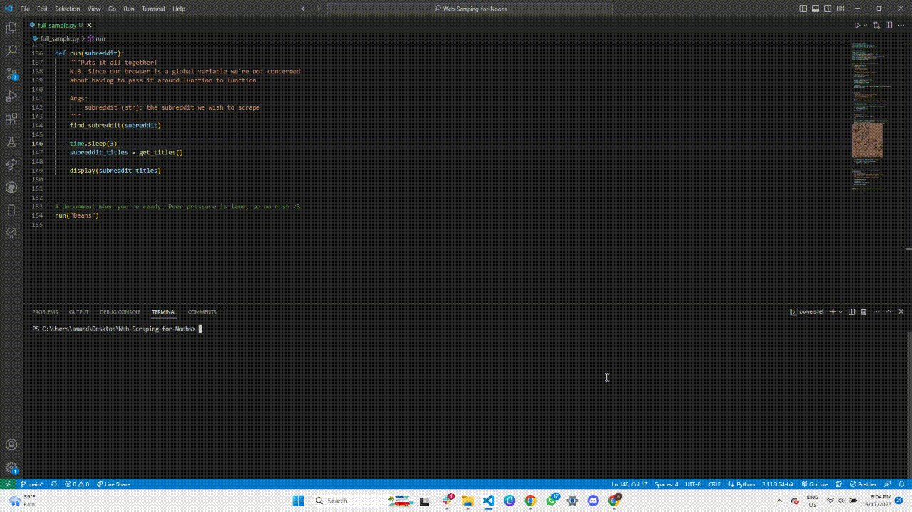

<br>


## FAQs and Common Mistakes

<details>
  <summary>🤔Which method of finding an element should I use?</summary>
  <br>
  
  > id -> name -> class name -> xpath
  
  <br>
  
Great question! There's a hierarchy of element identification that we typically follow when trying to locate an element, and an element's **id** takes the number one spot. Wherever possible, try to use an element's id as it is _unique_ to it and only it! In cases where that is not possible, next try **name**, then **class name**, and only if nothing else works should you go to **xpath**. 
  
  <br>
  
  The great thing about xpath is it is almost always going to work... if the elements on a webpage do not move (i.e. they remain static). This is especially helpful for older, less responsive, websites. However, several modern-day websites move their elements all around whether it be for responsiveness or even sometimes to fight back bots! This is not to say that you should never use xpath, but instead for you to use it with due caution😅
</details>

<br>

<details>
  <summary>🤔Why do I keep getting Chromedriver-related errors?</summary>
  <br>
  
Trust me, I have been there and **done that**. This is usually because:
  - You have not stored your chromedriver in the *same folder as your code*
  - You accidentally downloaded the wrong chromedriver version
  - Between now and the last time you ran your code a couple of days/weeks/months ago, your chromedriver got updated...
  
  
</details>

<br>

<details>
  <summary>🤔Why can I not get past typing into the searchbar?</summary>
  <br>
  
  **Hint, hint, NUDGE NUDGE NUDGE**
  
  ```python
  # searchbar.click()              # sometimes you need this👀
  ```

  
</details>

<br>

<details>
  <summary>🤔Why don't I see anything when my program is running in the terminal?</summary>
  <br>
  
  Did you uncomment ```chrome_options.add_argument("--headless")``` in your driver configurations👀. Tsk, tsk!

</details>

<br>

<details>
  <summary>🤔Why do I keep getting "No Such Element Found" exceptions?</summary>
  <br>
  
  Trust me, this will not be the last time you come across these bad boys! There are _typically_ two reasons why this happpens:
  - The element you are trying to find has a super complex/weirdly formatted id, class_name, name, etc. In this case, **definitely** try XPATH
 
  - Your code is going faster than your browser!
    - What this means is that sometimes your code is trying to move forward to the next step __(e.g. finding an element)__ when your browser isn't even finished carrying out its current task __(e.g. loading the page)__
 
    - Here is when you can throw in a quick ```time.sleep(1)``` to make your code wait 1 second before trying to continue. Or, if you are up for the challenge, try using [implcit or explicit wait times](https://selenium-python.readthedocs.io/waits.html)

</details>

<br>

<details>
  <summary>🤔What does "DevTools listening on ...yada yada yada..." mean?</summary>
  <br>
  
  That your chromedriver (aka browser) is up and running! We love to see it😏

</details>

<br>

# Optional Feature
If you are actually reading this section, you are a nerd and I deeply appreciate you for it ❤️.

Now, _what's the fun_ of scraping all these titles if they're just printed into the terminal and then... **nothing**! What if you want to do something else with them outside your program? Or track changes over time? Or do something else fun? The answer is simple: **store it** in a file! I, personally, am a fan of a good ole' **`.db file`**. 
<br>

### Code
> N.B. - you can also choose to add the titles to the database as soon as they are found, instead of adding them all at the end. Your choice! Both come with pros and cons you can ask me about😝

Here is how you can create a db file to host all the titles you've found:

```python
import sqlite3 # add this to the imports

....
....

def add_to_database(db_file_name, titles):
  """
  Creates a new table in a .db file, if one doesn't already exist, to hold the information 
  found in the subreddit.

  Args:
    db_file_name (str): the name of the database file to open
    titles (list of str): the list of titles to add to the database
  """
  # create the database
  conn = sqlite3.connect(db_file_name)
  cursor = self.conn.cursor()
  createTable = """CREATE TABLE IF NOT EXISTS
  srinfo(id INTEGER PRIMARY KEY autoincrement, title TEXT)"""
  cursor.execute(createTable)

  # add to database
  for title in titles:
      cursor.execute("INSERT INTO {table_name} (title) VALUES(?)"
                          .format(table_name='srinfo'),(title,))
  conn.commit()

```

<br>

### Sample Result
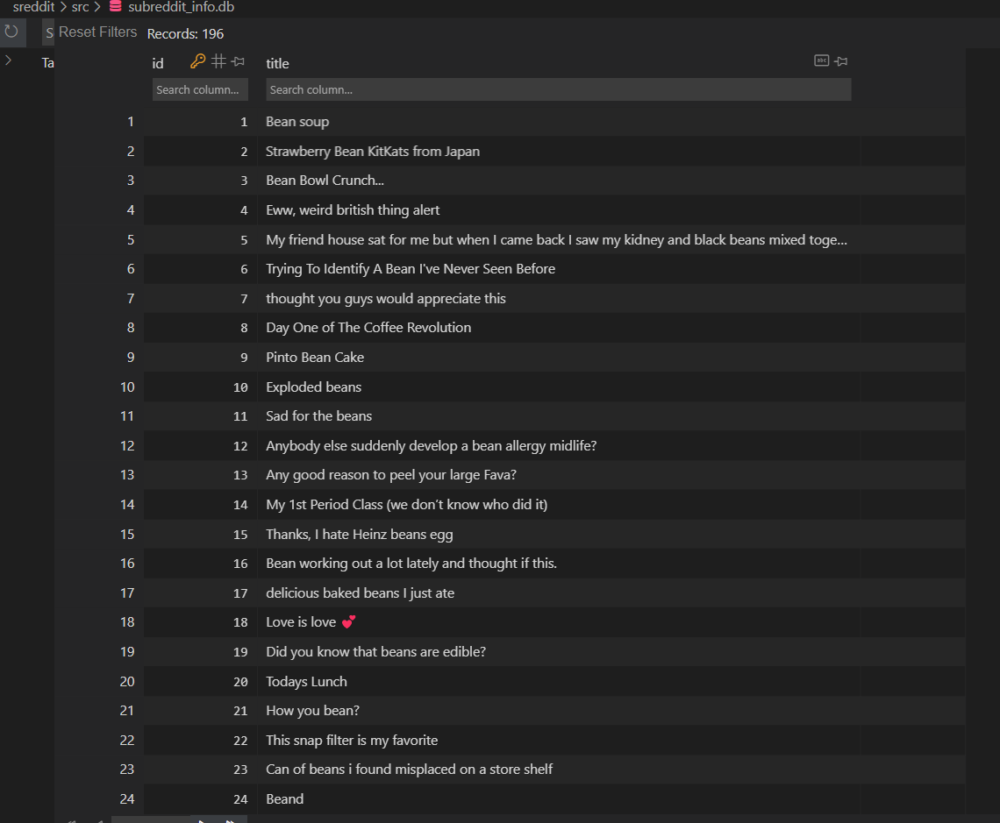


<br>
<hr>  
<br><br>  


# Resources
- [Python Selenium Documentation](https://selenium-python.readthedocs.io/index.html)
- [84 Popular Sites on the Internet that you can scrape](https://github.com/brendanbailey/Medium/blob/master/robots_txt/wikipedia_popular_sites.csv)
- [Figuring out whether or not you can scrape a site](https://medium.com/@brendangallegobailey/scraping-the-internets-most-popular-websites-a4c6f0be382d)

### Oh, and...
I have a pip package you can download if you're interested in doing more subreddit scraping without all the code! To install:
```python
pip install sreddit
```
For usage, and documentation, you can see my [source code😊](https://github.com/Mandy-cyber/SubRedditScraper).


<br><br>

[^1]: Source: https://chromedriver.chromium.org/
[^2]: I say 'all' very loosely. What I really mean is all the ones on the page you see before dynamic-rendering kicks in and makes it a pain to scrape! So you'll get probably get around 10 titles.
